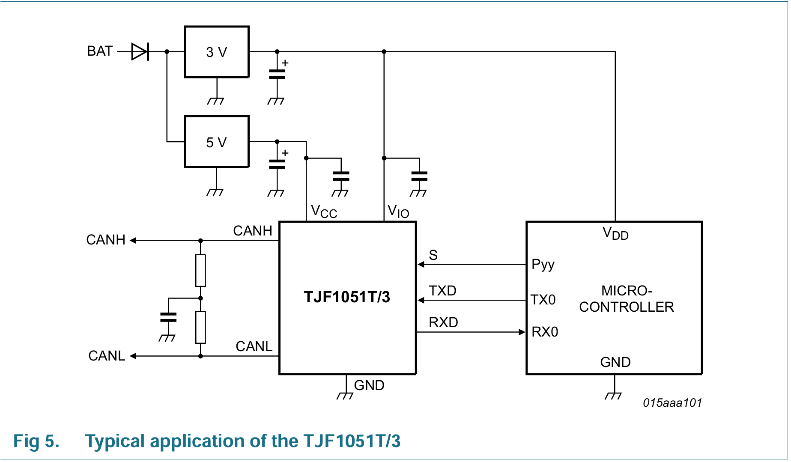

# 各接口接线

## usart

### RS485

### RS232

### TTL

## CAN

| MCU  | Peripheral | 描述 |
|------|------|------|
| TX    |  TX |      |
| RX    |  RX  |      |

### TJF1051 引脚定义

| Pin | Symbol | Description |
|-----|--------|-------------|
| 1   | TXD    | transmit data input |
| 2   | GND    | ground |
| 3   | VCC    | supply voltage |
| 4   | RXD    | receive data output; reads out data from the bus lines |
| 5   | n.c.   | not connected; in TJF1051T |
| 5   | VIO    | supply voltage for I/O level adapter; TJF1051T/3 only |
| 6   | CANL   | LOW-level CAN bus line |
| 7   | CANH   | HIGH-level CAN bus line |
| 8   | S      | Silent mode control input |

https://www.nxp.com/docs/en/data-sheet/TJF1051.pdf

## mii

| MCU  | Peripheral | 描述 |
|------|------|------|
| TX    |  TX |      |
| RX    |  RX  |      |