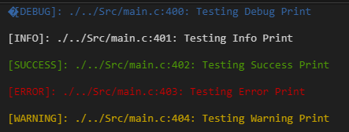
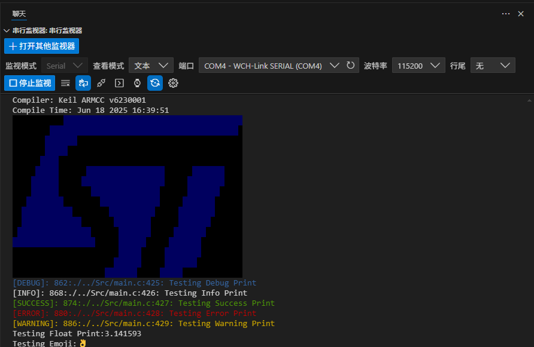

 # 不使用微库microlib AC6重定义打印浮点
 
头文件添加
```
  #include "stdio.h"
```
重定向printf
```
  typedef struct __FILE FILE;
  struct __FILE 
  { 
    int handle; 
  }; 
  FILE __stdout;           

  int fputc(int ch, FILE *f)
  {      
    while((USART1->SR&0X40)==0);          //这里使用的是串口1，如用其他串口请自行修改
      USART1->DR = (uint8_t) ch;      
      return ch;
  }
```
彩色Printf
```
// 定义颜色常量
#define COLOR_RESET   "\033[0m"
#define COLOR_RED     "\033[31m"
#define COLOR_GREEN   "\033[32m"
#define COLOR_YELLOW  "\033[33m"
#define COLOR_BLUE    "\033[34m"

// 定义不同级别的调试打印宏
#define INFO_PRINT(fmt, ...)     printf(COLOR_RESET    "[INFO]: %s:%d: " fmt COLOR_RESET "\n", __FILE__, __LINE__, ##__VA_ARGS__)
#define DEBUG_PRINT(fmt, ...)    printf(COLOR_BLUE    "[DEBUG]: %s:%d: " fmt COLOR_RESET "\n", __FILE__, __LINE__, ##__VA_ARGS__)
#define SUCCESS_PRINT(fmt, ...)  printf(COLOR_GREEN   "[SUCCESS]: %s:%d: " fmt COLOR_RESET "\n", __FILE__, __LINE__, ##__VA_ARGS__)
#define ERROR_PRINT(fmt, ...)    printf(COLOR_RED     "[ERROR]: %s:%d: " fmt COLOR_RESET "\n", __FILE__, __LINE__, ##__VA_ARGS__)
#define WARNING_PRINT(fmt, ...)  printf(COLOR_YELLOW  "[WARNING]: %s:%d: " fmt COLOR_RESET "\n", __FILE__, __LINE__, ##__VA_ARGS__)
```
清屏效果Vofa不可用
```
#define UART_CLEAR_USE_ANSI

// 嵌入式串口清屏宏
#ifdef UART_CLEAR_USE_ANSI
    // 方案1：使用ANSI转义序列（需要终端支持）
    #define CLEAR_SCREEN() printf("\033[2J\033[H")
#elif defined(UART_CLEAR_USE_FF)
    // 方案2：发送换页符（某些终端会清屏）
    #define CLEAR_SCREEN() printf("\f")
#elif defined(UART_CLEAR_USE_LOOP)
    // 方案3：用空白行填充（适用于不支持特殊控制码的终端）
    #define CLEAR_SCREEN() do { int i; for(i=0; i<50; i++) printf("\n"); } while(0)
#else
    // 默认方案：不执行清屏（安全选项）
    #define CLEAR_SCREEN()
#endif
```

打印编译器信息
```
// 编译器版本检测宏
#if defined(__ARMCC_VERSION)
    // Keil ARMCC（MDK-ARM）
    #define PRINT_COMPILER() printf(COLOR_RESET "Keil ARMCC v%d\n" COLOR_RESET, __ARMCC_VERSION)
#elif defined(__GNUC__)
    // GCC系列编译器（GNU Arm Embedded、RISC-V GCC等）
    #define PRINT_COMPILER() printf(COLOR_RESET "GCC %s\n" COLOR_RESET, __VERSION__)
#elif defined(__ICCARM__)
    // IAR EWARM
    #define PRINT_COMPILER() printf(COLOR_RESET "IAR EWARM %d\n" COLOR_RESET, __ICCARM__)
#elif defined(__CC_ARM)
    // ARM Compiler 6 (Arm Development Studio)
    #define PRINT_COMPILER() printf(COLOR_RESET "Arm Compiler %d\n" COLOR_RESET, __CC_ARM)
#elif defined(__SDCC_VERSION__)
    // SDCC (Small Device C Compiler)
    #define PRINT_COMPILER() printf(COLOR_RESET "SDCC %s\n" COLOR_RESET, __SDCC_VERSION__)
#else
    // 未知编译器
    #define PRINT_COMPILER() printf(COLOR_RESET "Unknow Compiler\n" COLOR_RESET)
#endif
```
// 打印编译时间

```
#define PRINT_COMPILE_TIME()           printf("Compile Time: %s\n", __DATE__ " " __TIME__)
```

# 完整代码
```
#define GetTick() HAL_GetTick()

// 定义颜色常量
#define COLOR_RESET   "\033[0m"
#define COLOR_RED     "\033[31m"
#define COLOR_GREEN   "\033[32m"
#define COLOR_YELLOW  "\033[33m"
#define COLOR_BLUE    "\033[34m"


// 定义不同级别的调试打印宏
#define INFO_PRINT(fmt, ...)     printf(COLOR_RESET    "[INFO]: %lu:%s:%d: " fmt COLOR_RESET "\n", (unsigned long)GetTick(), __FILE__, __LINE__, ##__VA_ARGS__)
#define DEBUG_PRINT(fmt, ...)    printf(COLOR_BLUE    "[DEBUG]: %lu:%s:%d: " fmt COLOR_RESET "\n", (unsigned long)GetTick(), __FILE__, __LINE__, ##__VA_ARGS__)
#define SUCCESS_PRINT(fmt, ...)  printf(COLOR_GREEN   "[SUCCESS]: %lu:%s:%d: " fmt COLOR_RESET "\n", (unsigned long)GetTick(), __FILE__, __LINE__, ##__VA_ARGS__)
#define ERROR_PRINT(fmt, ...)    printf(COLOR_RED     "[ERROR]: %lu:%s:%d: " fmt COLOR_RESET "\n", (unsigned long)GetTick(), __FILE__, __LINE__, ##__VA_ARGS__)
#define WARNING_PRINT(fmt, ...)  printf(COLOR_YELLOW  "[WARNING]: %lu:%s:%d: " fmt COLOR_RESET "\n", (unsigned long)GetTick(), __FILE__, __LINE__, ##__VA_ARGS__)

// 打印编译时间
#define PRINT_COMPILE_TIME()           printf("Compile Time: %s\n", __DATE__ " " __TIME__)


// 编译器版本检测宏（保持与清屏宏一致的条件编译风格）
#if defined(__ARMCC_VERSION)
    // Keil ARMCC（MDK-ARM）
    #define PRINT_COMPILER() printf(COLOR_RESET "Compiler: Keil ARMCC v%d\n" COLOR_RESET, __ARMCC_VERSION)
#elif defined(__GNUC__)
    // GCC系列编译器（GNU Arm Embedded、RISC-V GCC等）
    #define PRINT_COMPILER() printf(COLOR_RESET "Compiler: GCC %s\n" COLOR_RESET, __VERSION__)
#elif defined(__ICCARM__)
    // IAR EWARM
    #define PRINT_COMPILER() printf(COLOR_RESET "Compiler: IAR EWARM %d\n" COLOR_RESET, __ICCARM__)
#elif defined(__CC_ARM)
    // ARM Compiler 6 (Arm Development Studio)
    #define PRINT_COMPILER() printf(COLOR_RESET "Compiler: Compiler:Arm Compiler %d\n" COLOR_RESET, __CC_ARM)
#elif defined(__SDCC_VERSION__)
    // SDCC (Small Device C Compiler)
    #define PRINT_COMPILER() printf(COLOR_RESET "Compiler: SDCC %s\n" COLOR_RESET, __SDCC_VERSION__)
#else
    // 未知编译器
    #define PRINT_COMPILER() printf(COLOR_RESET "Compiler: Unknow Compiler\n" COLOR_RESET)
#endif


#define UART_CLEAR_USE_ANSI

// 嵌入式串口清屏宏
#ifdef UART_CLEAR_USE_ANSI
    // 方案1：使用ANSI转义序列（需要终端支持）
    #define CLEAR_SCREEN() printf("\033[2J\033[H")
#elif defined(UART_CLEAR_USE_FF)
    // 方案2：发送换页符（某些终端会清屏）
    #define CLEAR_SCREEN() printf("\f")
#elif defined(UART_CLEAR_USE_LOOP)
    // 方案3：用空白行填充（适用于不支持特殊控制码的终端）
    #define CLEAR_SCREEN() do { int i; for(i=0; i<50; i++) printf("\n"); } while(0)
#else
    // 默认方案：不执行清屏（安全选项）
    #define CLEAR_SCREEN()
#endif
```


main函数
```
  float pai = 3.1415926f;
  CLEAR_SCREEN();
  PRINT_COMPILER();
  PRINT_COMPILE_TIME();
  printf("\x1b[48;5;16m \x1b[48;5;16m \x1b[48;5;16m \x1b[48;5;16m \x1b[48;5;16m \x1b[48;5;16m \x1b[48;5;16m \x1b[48;5;16m \x1b[48;5;16m \x1b[48;5;16m \x1b[48;5;16m \x1b[48;5;17m \x1b[48;5;17m \x1b[48;5;17m \x1b[48;5;17m \x1b[48;5;17m \x1b[48;5;17m \x1b[48;5;17m \x1b[48;5;17m \x1b[48;5;17m \x1b[48;5;17m \x1b[48;5;17m \x1b[48;5;17m \x1b[48;5;17m \x1b[48;5;17m \x1b[48;5;17m \x1b[48;5;17m \x1b[48;5;17m \x1b[48;5;17m \x1b[48;5;17m \x1b[48;5;17m \x1b[48;5;17m \x1b[48;5;17m \x1b[48;5;17m \x1b[48;5;17m \x1b[48;5;17m \x1b[48;5;17m \x1b[48;5;17m \x1b[48;5;17m \x1b[48;5;17m \x1b[48;5;17m \x1b[48;5;17m \x1b[48;5;17m \x1b[48;5;17m \x1b[48;5;17m \x1b[48;5;17m \x1b[48;5;17m \x1b[48;5;17m \x1b[48;5;17m \x1b[48;5;17m \x1b[0m\n");
  printf("\x1b[48;5;16m \x1b[48;5;16m \x1b[48;5;16m \x1b[48;5;16m \x1b[48;5;16m \x1b[48;5;16m \x1b[48;5;16m \x1b[48;5;16m \x1b[48;5;17m \x1b[48;5;17m \x1b[48;5;17m \x1b[48;5;17m \x1b[48;5;17m \x1b[48;5;17m \x1b[48;5;17m \x1b[48;5;17m \x1b[48;5;17m \x1b[48;5;17m \x1b[48;5;17m \x1b[48;5;17m \x1b[48;5;17m \x1b[48;5;17m \x1b[48;5;17m \x1b[48;5;17m \x1b[48;5;17m \x1b[48;5;17m \x1b[48;5;17m \x1b[48;5;17m \x1b[48;5;17m \x1b[48;5;17m \x1b[48;5;17m \x1b[48;5;17m \x1b[48;5;17m \x1b[48;5;17m \x1b[48;5;17m \x1b[48;5;17m \x1b[48;5;17m \x1b[48;5;17m \x1b[48;5;17m \x1b[48;5;17m \x1b[48;5;17m \x1b[48;5;17m \x1b[48;5;17m \x1b[48;5;17m \x1b[48;5;17m \x1b[48;5;17m \x1b[48;5;17m \x1b[48;5;17m \x1b[48;5;17m \x1b[48;5;16m \x1b[0m\n");
  printf("\x1b[48;5;16m \x1b[48;5;16m \x1b[48;5;16m \x1b[48;5;16m \x1b[48;5;16m \x1b[48;5;16m \x1b[48;5;16m \x1b[48;5;17m \x1b[48;5;17m \x1b[48;5;17m \x1b[48;5;17m \x1b[48;5;17m \x1b[48;5;17m \x1b[48;5;17m \x1b[48;5;16m \x1b[48;5;16m \x1b[48;5;16m \x1b[48;5;16m \x1b[48;5;16m \x1b[48;5;16m \x1b[48;5;16m \x1b[48;5;16m \x1b[48;5;16m \x1b[48;5;16m \x1b[48;5;16m \x1b[48;5;16m \x1b[48;5;16m \x1b[48;5;16m \x1b[48;5;16m \x1b[48;5;16m \x1b[48;5;16m \x1b[48;5;16m \x1b[48;5;16m \x1b[48;5;16m \x1b[48;5;16m \x1b[48;5;16m \x1b[48;5;16m \x1b[48;5;16m \x1b[48;5;16m \x1b[48;5;16m \x1b[48;5;16m \x1b[48;5;16m \x1b[48;5;16m \x1b[48;5;16m \x1b[48;5;16m \x1b[48;5;16m \x1b[48;5;16m \x1b[48;5;16m \x1b[48;5;16m \x1b[48;5;16m \x1b[0m\n");
  printf("\x1b[48;5;16m \x1b[48;5;16m \x1b[48;5;16m \x1b[48;5;16m \x1b[48;5;16m \x1b[48;5;16m \x1b[48;5;16m \x1b[48;5;17m \x1b[48;5;17m \x1b[48;5;17m \x1b[48;5;17m \x1b[48;5;17m \x1b[48;5;16m \x1b[48;5;16m \x1b[48;5;16m \x1b[48;5;16m \x1b[48;5;16m \x1b[48;5;16m \x1b[48;5;16m \x1b[48;5;16m \x1b[48;5;16m \x1b[48;5;16m \x1b[48;5;16m \x1b[48;5;16m \x1b[48;5;16m \x1b[48;5;16m \x1b[48;5;16m \x1b[48;5;16m \x1b[48;5;16m \x1b[48;5;16m \x1b[48;5;16m \x1b[48;5;16m \x1b[48;5;16m \x1b[48;5;16m \x1b[48;5;16m \x1b[48;5;16m \x1b[48;5;16m \x1b[48;5;16m \x1b[48;5;16m \x1b[48;5;16m \x1b[48;5;16m \x1b[48;5;16m \x1b[48;5;16m \x1b[48;5;16m \x1b[48;5;16m \x1b[48;5;16m \x1b[48;5;16m \x1b[48;5;16m \x1b[48;5;16m \x1b[48;5;16m \x1b[0m\n");
  printf("\x1b[48;5;16m \x1b[48;5;16m \x1b[48;5;16m \x1b[48;5;16m \x1b[48;5;16m \x1b[48;5;16m \x1b[48;5;17m \x1b[48;5;17m \x1b[48;5;17m \x1b[48;5;17m \x1b[48;5;16m \x1b[48;5;16m \x1b[48;5;16m \x1b[48;5;16m \x1b[48;5;16m \x1b[48;5;16m \x1b[48;5;16m \x1b[48;5;16m \x1b[48;5;16m \x1b[48;5;16m \x1b[48;5;16m \x1b[48;5;16m \x1b[48;5;16m \x1b[48;5;16m \x1b[48;5;16m \x1b[48;5;16m \x1b[48;5;16m \x1b[48;5;16m \x1b[48;5;16m \x1b[48;5;16m \x1b[48;5;16m \x1b[48;5;16m \x1b[48;5;16m \x1b[48;5;16m \x1b[48;5;16m \x1b[48;5;16m \x1b[48;5;16m \x1b[48;5;16m \x1b[48;5;16m \x1b[48;5;16m \x1b[48;5;16m \x1b[48;5;16m \x1b[48;5;16m \x1b[48;5;16m \x1b[48;5;16m \x1b[48;5;16m \x1b[48;5;16m \x1b[48;5;16m \x1b[48;5;16m \x1b[48;5;16m \x1b[0m\n");
  printf("\x1b[48;5;16m \x1b[48;5;16m \x1b[48;5;16m \x1b[48;5;16m \x1b[48;5;16m \x1b[48;5;17m \x1b[48;5;17m \x1b[48;5;17m \x1b[48;5;17m \x1b[48;5;17m \x1b[48;5;16m \x1b[48;5;16m \x1b[48;5;16m \x1b[48;5;16m \x1b[48;5;16m \x1b[48;5;16m \x1b[48;5;17m \x1b[48;5;17m \x1b[48;5;17m \x1b[48;5;17m \x1b[48;5;17m \x1b[48;5;17m \x1b[48;5;17m \x1b[48;5;17m \x1b[48;5;17m \x1b[48;5;17m \x1b[48;5;17m \x1b[48;5;17m \x1b[48;5;17m \x1b[48;5;17m \x1b[48;5;17m \x1b[48;5;17m \x1b[48;5;17m \x1b[48;5;16m \x1b[48;5;16m \x1b[48;5;16m \x1b[48;5;16m \x1b[48;5;16m \x1b[48;5;16m \x1b[48;5;17m \x1b[48;5;17m \x1b[48;5;17m \x1b[48;5;17m \x1b[48;5;17m \x1b[48;5;17m \x1b[48;5;17m \x1b[48;5;16m \x1b[48;5;16m \x1b[48;5;16m \x1b[48;5;16m \x1b[0m\n");
  printf("\x1b[48;5;16m \x1b[48;5;16m \x1b[48;5;16m \x1b[48;5;16m \x1b[48;5;17m \x1b[48;5;17m \x1b[48;5;17m \x1b[48;5;17m \x1b[48;5;17m \x1b[48;5;17m \x1b[48;5;16m \x1b[48;5;16m \x1b[48;5;16m \x1b[48;5;16m \x1b[48;5;16m \x1b[48;5;17m \x1b[48;5;17m \x1b[48;5;17m \x1b[48;5;17m \x1b[48;5;17m \x1b[48;5;17m \x1b[48;5;17m \x1b[48;5;17m \x1b[48;5;17m \x1b[48;5;17m \x1b[48;5;17m \x1b[48;5;17m \x1b[48;5;17m \x1b[48;5;17m \x1b[48;5;17m \x1b[48;5;17m \x1b[48;5;17m \x1b[48;5;17m \x1b[48;5;16m \x1b[48;5;16m \x1b[48;5;16m \x1b[48;5;16m \x1b[48;5;16m \x1b[48;5;17m \x1b[48;5;17m \x1b[48;5;17m \x1b[48;5;17m \x1b[48;5;17m \x1b[48;5;17m \x1b[48;5;17m \x1b[48;5;17m \x1b[48;5;16m \x1b[48;5;16m \x1b[48;5;16m \x1b[48;5;16m \x1b[0m\n");
  printf("\x1b[48;5;16m \x1b[48;5;16m \x1b[48;5;16m \x1b[48;5;16m \x1b[48;5;17m \x1b[48;5;17m \x1b[48;5;17m \x1b[48;5;17m \x1b[48;5;17m \x1b[48;5;17m \x1b[48;5;16m \x1b[48;5;16m \x1b[48;5;16m \x1b[48;5;16m \x1b[48;5;16m \x1b[48;5;16m \x1b[48;5;16m \x1b[48;5;17m \x1b[48;5;17m \x1b[48;5;17m \x1b[48;5;17m \x1b[48;5;17m \x1b[48;5;17m \x1b[48;5;17m \x1b[48;5;17m \x1b[48;5;17m \x1b[48;5;17m \x1b[48;5;17m \x1b[48;5;17m \x1b[48;5;17m \x1b[48;5;17m \x1b[48;5;17m \x1b[48;5;16m \x1b[48;5;16m \x1b[48;5;16m \x1b[48;5;16m \x1b[48;5;16m \x1b[48;5;16m \x1b[48;5;17m \x1b[48;5;17m \x1b[48;5;17m \x1b[48;5;17m \x1b[48;5;17m \x1b[48;5;17m \x1b[48;5;17m \x1b[48;5;16m \x1b[48;5;16m \x1b[48;5;16m \x1b[48;5;16m \x1b[48;5;16m \x1b[0m\n");
  printf("\x1b[48;5;16m \x1b[48;5;16m \x1b[48;5;16m \x1b[48;5;17m \x1b[48;5;17m \x1b[48;5;17m \x1b[48;5;17m \x1b[48;5;17m \x1b[48;5;17m \x1b[48;5;17m \x1b[48;5;17m \x1b[48;5;16m \x1b[48;5;16m \x1b[48;5;16m \x1b[48;5;16m \x1b[48;5;16m \x1b[48;5;16m \x1b[48;5;16m \x1b[48;5;16m \x1b[48;5;17m \x1b[48;5;17m \x1b[48;5;17m \x1b[48;5;17m \x1b[48;5;17m \x1b[48;5;17m \x1b[48;5;17m \x1b[48;5;17m \x1b[48;5;17m \x1b[48;5;17m \x1b[48;5;17m \x1b[48;5;17m \x1b[48;5;17m \x1b[48;5;16m \x1b[48;5;16m \x1b[48;5;16m \x1b[48;5;16m \x1b[48;5;16m \x1b[48;5;17m \x1b[48;5;17m \x1b[48;5;17m \x1b[48;5;17m \x1b[48;5;17m \x1b[48;5;17m \x1b[48;5;17m \x1b[48;5;16m \x1b[48;5;16m \x1b[48;5;16m \x1b[48;5;16m \x1b[48;5;16m \x1b[48;5;16m \x1b[0m\n");
  printf("\x1b[48;5;16m \x1b[48;5;16m \x1b[48;5;17m \x1b[48;5;17m \x1b[48;5;17m \x1b[48;5;17m \x1b[48;5;17m \x1b[48;5;17m \x1b[48;5;17m \x1b[48;5;17m \x1b[48;5;17m \x1b[48;5;17m \x1b[48;5;17m \x1b[48;5;16m \x1b[48;5;16m \x1b[48;5;16m \x1b[48;5;16m \x1b[48;5;16m \x1b[48;5;16m \x1b[48;5;16m \x1b[48;5;16m \x1b[48;5;17m \x1b[48;5;17m \x1b[48;5;17m \x1b[48;5;17m \x1b[48;5;17m \x1b[48;5;17m \x1b[48;5;17m \x1b[48;5;17m \x1b[48;5;17m \x1b[48;5;17m \x1b[48;5;16m \x1b[48;5;16m \x1b[48;5;16m \x1b[48;5;16m \x1b[48;5;16m \x1b[48;5;17m \x1b[48;5;17m \x1b[48;5;17m \x1b[48;5;17m \x1b[48;5;17m \x1b[48;5;17m \x1b[48;5;17m \x1b[48;5;17m \x1b[48;5;16m \x1b[48;5;16m \x1b[48;5;16m \x1b[48;5;16m \x1b[48;5;16m \x1b[48;5;16m \x1b[0m\n");
  printf("\x1b[48;5;16m \x1b[48;5;16m \x1b[48;5;17m \x1b[48;5;17m \x1b[48;5;17m \x1b[48;5;17m \x1b[48;5;17m \x1b[48;5;17m \x1b[48;5;17m \x1b[48;5;17m \x1b[48;5;17m \x1b[48;5;17m \x1b[48;5;17m \x1b[48;5;17m \x1b[48;5;17m \x1b[48;5;16m \x1b[48;5;16m \x1b[48;5;16m \x1b[48;5;16m \x1b[48;5;16m \x1b[48;5;16m \x1b[48;5;16m \x1b[48;5;17m \x1b[48;5;17m \x1b[48;5;17m \x1b[48;5;17m \x1b[48;5;17m \x1b[48;5;17m \x1b[48;5;17m \x1b[48;5;17m \x1b[48;5;16m \x1b[48;5;16m \x1b[48;5;16m \x1b[48;5;16m \x1b[48;5;16m \x1b[48;5;16m \x1b[48;5;17m \x1b[48;5;17m \x1b[48;5;17m \x1b[48;5;17m \x1b[48;5;17m \x1b[48;5;17m \x1b[48;5;17m \x1b[48;5;16m \x1b[48;5;16m \x1b[48;5;16m \x1b[48;5;16m \x1b[48;5;16m \x1b[48;5;16m \x1b[48;5;16m \x1b[0m\n");
  printf("\x1b[48;5;16m \x1b[48;5;17m \x1b[48;5;17m \x1b[48;5;17m \x1b[48;5;17m \x1b[48;5;17m \x1b[48;5;17m \x1b[48;5;17m \x1b[48;5;17m \x1b[48;5;17m \x1b[48;5;17m \x1b[48;5;17m \x1b[48;5;17m \x1b[48;5;17m \x1b[48;5;17m \x1b[48;5;17m \x1b[48;5;17m \x1b[48;5;16m \x1b[48;5;16m \x1b[48;5;16m \x1b[48;5;16m \x1b[48;5;16m \x1b[48;5;16m \x1b[48;5;17m \x1b[48;5;17m \x1b[48;5;17m \x1b[48;5;17m \x1b[48;5;17m \x1b[48;5;17m \x1b[48;5;17m \x1b[48;5;16m \x1b[48;5;16m \x1b[48;5;16m \x1b[48;5;16m \x1b[48;5;16m \x1b[48;5;17m \x1b[48;5;17m \x1b[48;5;17m \x1b[48;5;17m \x1b[48;5;17m \x1b[48;5;17m \x1b[48;5;17m \x1b[48;5;16m \x1b[48;5;16m \x1b[48;5;16m \x1b[48;5;16m \x1b[48;5;16m \x1b[48;5;16m \x1b[48;5;16m \x1b[48;5;16m \x1b[0m\n");
  printf("\x1b[48;5;17m \x1b[48;5;17m \x1b[48;5;17m \x1b[48;5;17m \x1b[48;5;17m \x1b[48;5;17m \x1b[48;5;17m \x1b[48;5;17m \x1b[48;5;17m \x1b[48;5;17m \x1b[48;5;17m \x1b[48;5;17m \x1b[48;5;17m \x1b[48;5;17m \x1b[48;5;17m \x1b[48;5;17m \x1b[48;5;17m \x1b[48;5;17m \x1b[48;5;16m \x1b[48;5;16m \x1b[48;5;16m \x1b[48;5;16m \x1b[48;5;16m \x1b[48;5;17m \x1b[48;5;17m \x1b[48;5;17m \x1b[48;5;17m \x1b[48;5;17m \x1b[48;5;17m \x1b[48;5;16m \x1b[48;5;16m \x1b[48;5;16m \x1b[48;5;16m \x1b[48;5;16m \x1b[48;5;17m \x1b[48;5;17m \x1b[48;5;17m \x1b[48;5;17m \x1b[48;5;17m \x1b[48;5;17m \x1b[48;5;17m \x1b[48;5;16m \x1b[48;5;16m \x1b[48;5;16m \x1b[48;5;16m \x1b[48;5;16m \x1b[48;5;16m \x1b[48;5;16m \x1b[48;5;16m \x1b[48;5;16m \x1b[0m\n");
  printf("\x1b[48;5;16m \x1b[48;5;16m \x1b[48;5;16m \x1b[48;5;16m \x1b[48;5;16m \x1b[48;5;16m \x1b[48;5;16m \x1b[48;5;16m \x1b[48;5;16m \x1b[48;5;16m \x1b[48;5;16m \x1b[48;5;16m \x1b[48;5;16m \x1b[48;5;16m \x1b[48;5;16m \x1b[48;5;16m \x1b[48;5;16m \x1b[48;5;16m \x1b[48;5;16m \x1b[48;5;16m \x1b[48;5;16m \x1b[48;5;16m \x1b[48;5;16m \x1b[48;5;17m \x1b[48;5;17m \x1b[48;5;17m \x1b[48;5;17m \x1b[48;5;17m \x1b[48;5;16m \x1b[48;5;16m \x1b[48;5;16m \x1b[48;5;16m \x1b[48;5;16m \x1b[48;5;17m \x1b[48;5;17m \x1b[48;5;17m \x1b[48;5;17m \x1b[48;5;17m \x1b[48;5;17m \x1b[48;5;17m \x1b[48;5;17m \x1b[48;5;16m \x1b[48;5;16m \x1b[48;5;16m \x1b[48;5;16m \x1b[48;5;16m \x1b[48;5;16m \x1b[48;5;16m \x1b[48;5;16m \x1b[48;5;16m \x1b[0m\n");
  printf("\x1b[48;5;16m \x1b[48;5;16m \x1b[48;5;16m \x1b[48;5;16m \x1b[48;5;16m \x1b[48;5;16m \x1b[48;5;16m \x1b[48;5;16m \x1b[48;5;16m \x1b[48;5;16m \x1b[48;5;16m \x1b[48;5;16m \x1b[48;5;16m \x1b[48;5;16m \x1b[48;5;16m \x1b[48;5;16m \x1b[48;5;16m \x1b[48;5;16m \x1b[48;5;16m \x1b[48;5;16m \x1b[48;5;16m \x1b[48;5;16m \x1b[48;5;17m \x1b[48;5;17m \x1b[48;5;17m \x1b[48;5;17m \x1b[48;5;17m \x1b[48;5;17m \x1b[48;5;16m \x1b[48;5;16m \x1b[48;5;16m \x1b[48;5;16m \x1b[48;5;16m \x1b[48;5;17m \x1b[48;5;17m \x1b[48;5;17m \x1b[48;5;17m \x1b[48;5;17m \x1b[48;5;17m \x1b[48;5;17m \x1b[48;5;16m \x1b[48;5;16m \x1b[48;5;16m \x1b[48;5;16m \x1b[48;5;16m \x1b[48;5;16m \x1b[48;5;16m \x1b[48;5;16m \x1b[48;5;16m \x1b[48;5;16m \x1b[0m\n");
  printf("\x1b[48;5;16m \x1b[48;5;16m \x1b[48;5;16m \x1b[48;5;16m \x1b[48;5;16m \x1b[48;5;16m \x1b[48;5;16m \x1b[48;5;16m \x1b[48;5;16m \x1b[48;5;16m \x1b[48;5;16m \x1b[48;5;16m \x1b[48;5;16m \x1b[48;5;16m \x1b[48;5;16m \x1b[48;5;16m \x1b[48;5;16m \x1b[48;5;16m \x1b[48;5;16m \x1b[48;5;16m \x1b[48;5;17m \x1b[48;5;17m \x1b[48;5;17m \x1b[48;5;17m \x1b[48;5;17m \x1b[48;5;17m \x1b[48;5;17m \x1b[48;5;16m \x1b[48;5;16m \x1b[48;5;16m \x1b[48;5;16m \x1b[48;5;16m \x1b[48;5;17m \x1b[48;5;17m \x1b[48;5;17m \x1b[48;5;17m \x1b[48;5;17m \x1b[48;5;16m \x1b[48;5;16m \x1b[48;5;16m \x1b[48;5;16m \x1b[48;5;16m \x1b[48;5;16m \x1b[48;5;16m \x1b[48;5;16m \x1b[48;5;16m \x1b[48;5;16m \x1b[48;5;16m \x1b[48;5;16m \x1b[48;5;16m \x1b[0m\n");
  DEBUG_PRINT("Testing Debug Print");
  INFO_PRINT("Testing Info Print");
  SUCCESS_PRINT("Testing Success Print");
  ERROR_PRINT("Testing Error Print");
  WARNING_PRINT("Testing Warning Print");
  printf("Testing Float Print:%f\r\n", pai);
  printf("Testing Emoji:👌\r\n");
```

## 效果演示
VOFA

>

VSCode

>

完整版测试

>