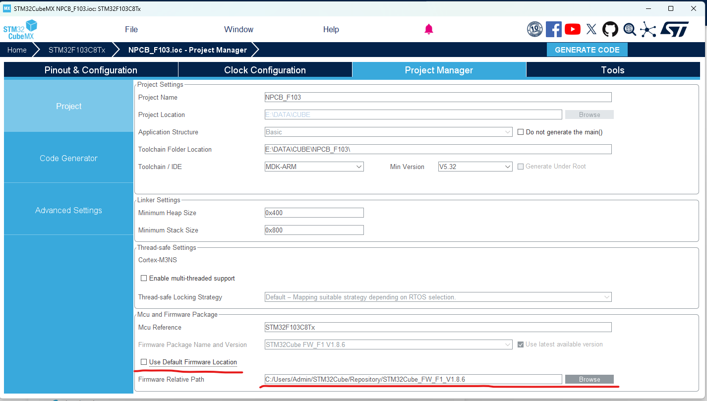
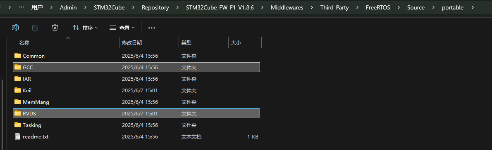

# MDK6_CUBE_Freertos





打开以下目录
```
C:\Users\Admin\STM32Cube\Repository\STM32Cube_FW_F1_V1.8.6\Middlewares\Third_Party\FreeRTOS\Source\portable
```


将RVDS内所有文件复制，替换GCC所有文件。

再次生成代码即可

参考链接：https://blog.csdn.net/tytyvyibijk/article/details/125589038