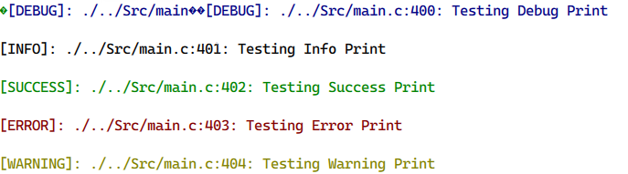

 # 不使用微库microlib AC6重定义打印浮点
 
头文件添加
```
  #include "stdio.h"
```
重定向printf
```
  typedef struct __FILE FILE;
  struct __FILE 
  { 
    int handle; 
  }; 
  FILE __stdout;           

  int fputc(int ch, FILE *f)
  {      
    while((USART1->SR&0X40)==0);          //这里使用的是串口1，如用其他串口请自行修改
      USART1->DR = (uint8_t) ch;      
      return ch;
  }
```
彩色Printf
```
// 定义颜色常量
#define COLOR_RESET   "\033[0m"
#define COLOR_RED     "\033[31m"
#define COLOR_GREEN   "\033[32m"
#define COLOR_YELLOW  "\033[33m"
#define COLOR_BLUE    "\033[34m"

// 定义不同级别的调试打印宏
#define INFO_PRINT(fmt, ...)     printf(COLOR_RESET    "[INFO]: %s:%d: " fmt COLOR_RESET "\n", __FILE__, __LINE__, ##__VA_ARGS__)
#define DEBUG_PRINT(fmt, ...)    printf(COLOR_BLUE    "[DEBUG]: %s:%d: " fmt COLOR_RESET "\n", __FILE__, __LINE__, ##__VA_ARGS__)
#define SUCCESS_PRINT(fmt, ...)  printf(COLOR_GREEN   "[SUCCESS]: %s:%d: " fmt COLOR_RESET "\n", __FILE__, __LINE__, ##__VA_ARGS__)
#define ERROR_PRINT(fmt, ...)    printf(COLOR_RED     "[ERROR]: %s:%d: " fmt COLOR_RESET "\n", __FILE__, __LINE__, ##__VA_ARGS__)
#define WARNING_PRINT(fmt, ...)  printf(COLOR_YELLOW  "[WARNING]: %s:%d: " fmt COLOR_RESET "\n", __FILE__, __LINE__, ##__VA_ARGS__)
```
清屏效果Vofa不可用
```
#define UART_CLEAR_USE_ANSI

// 嵌入式串口清屏宏
#ifdef UART_CLEAR_USE_ANSI
    // 方案1：使用ANSI转义序列（需要终端支持）
    #define CLEAR_SCREEN() printf("\033[2J\033[H")
#elif defined(UART_CLEAR_USE_FF)
    // 方案2：发送换页符（某些终端会清屏）
    #define CLEAR_SCREEN() printf("\f")
#elif defined(UART_CLEAR_USE_LOOP)
    // 方案3：用空白行填充（适用于不支持特殊控制码的终端）
    #define CLEAR_SCREEN() do { int i; for(i=0; i<50; i++) printf("\n"); } while(0)
#else
    // 默认方案：不执行清屏（安全选项）
    #define CLEAR_SCREEN()
#endif
```


## 效果演示
VOFA

>

VSCode

>